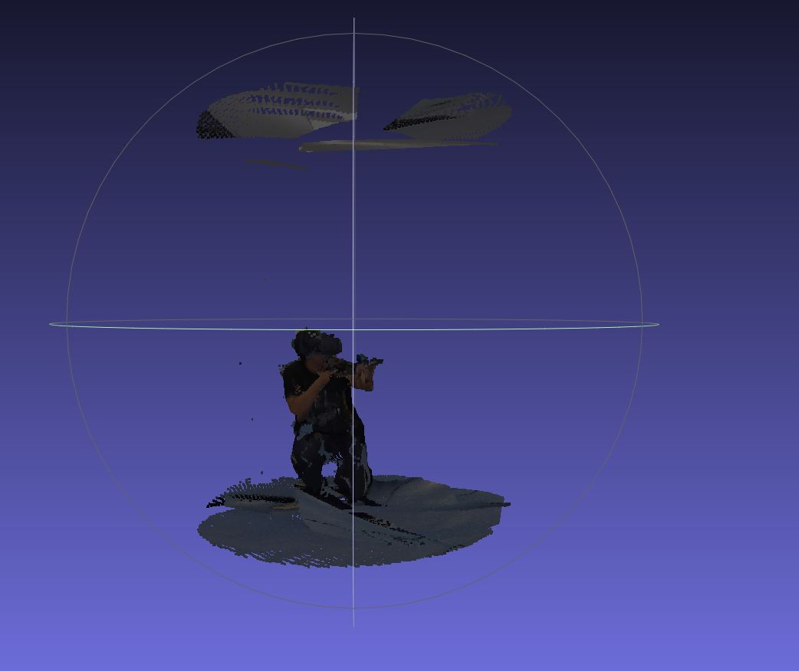

## Results of Volumetric Systems:

---

[TOC]

### 0. Introduction

#TODO

---

### 1. Baseline

+ The scenario of university WIFI (transmit from my laptop to my Ipads): 

  **Average Upload Speed:** 25Mbps ~ 45Mbps

  + **Test Case 1:** Transmitting volumetric video: *22-12-02-07-59-19_Vive* (after removing the background)
    + **Total files number:** 628 files
    + **Total size:** 2.25GB
    + **Total duration of transmission: ** 169.74066042900085s
  + **Test Case 2: ** Transmitting volumetric video: *22-12-02-08-00-51_Vivesit* (after removing the background)
    + **Total files number:** 491 files
    + **Total size: ** 1.66GB
    + **Total duration of transmission: ** 44.87525129318237s

---

### 2. Tiling

+ Tiling each ply file into several blocks, then only transmit the blocks that can be seen by users.

+ The original ply file:

  

---

### 3. Demo

The following is the demo we captured from the browser (The Volumetric Video is transmitted end to end by WebRTC protocol). 

