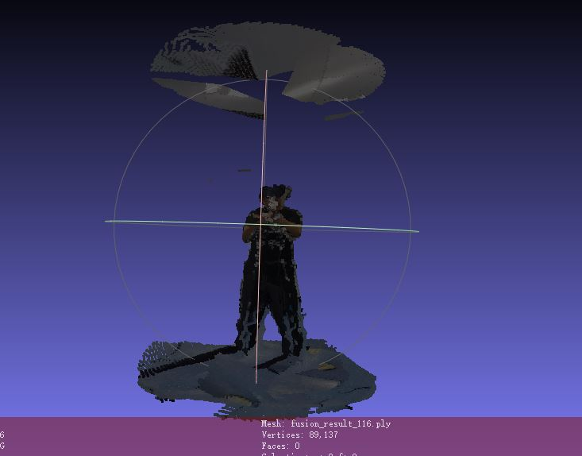
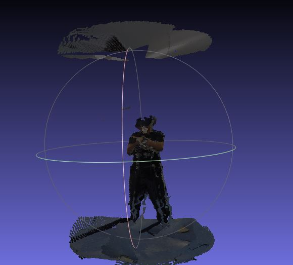
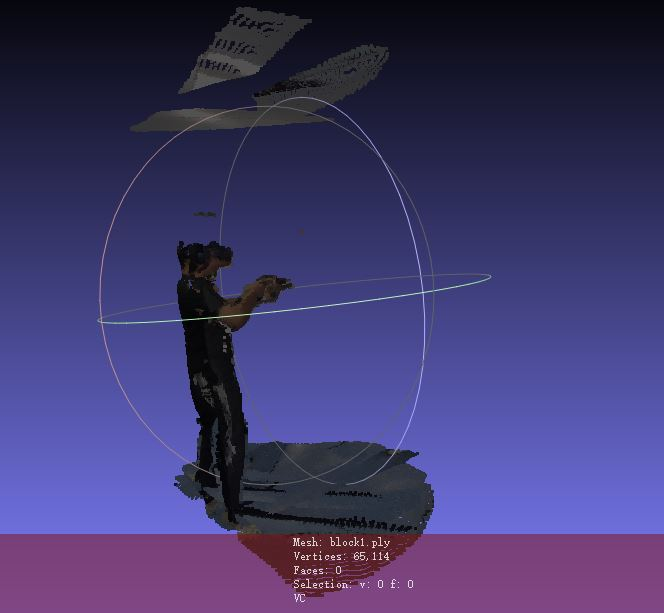
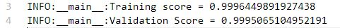
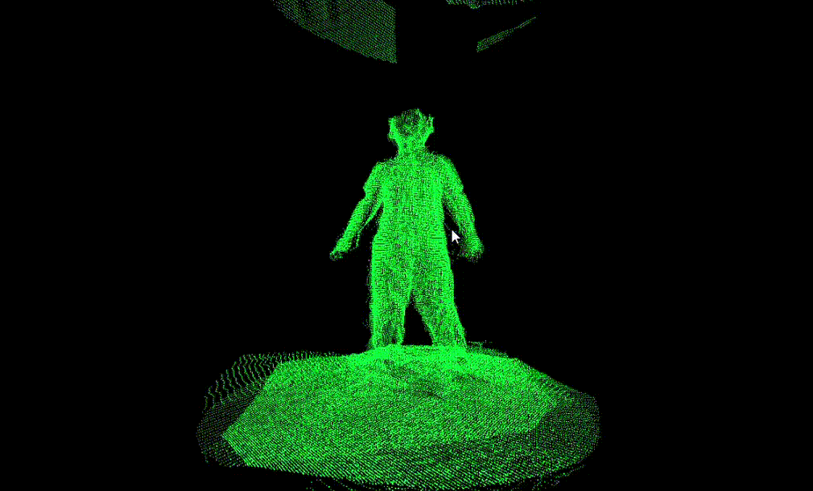

## Results of Volumetric Systems:

---

[TOC]

### 0. Introduction

#TODO

---

### 1. Baseline

+ The scenario of university WIFI (transmit from my laptop to my Ipads): 

  **Average Upload Speed:** 25Mbps ~ 45Mbps

  + **Test Case 1:** Transmitting volumetric video: *22-12-02-07-59-19_Vive* (after removing the background)
    + **Total files number:** 628 files
    + **Total size:** 2.25GB
    + **Total duration of transmission: ** 169.74066042900085s
  + **Test Case 2: ** Transmitting volumetric video: *22-12-02-08-00-51_Vivesit* (after removing the background)
    + **Total files number:** 491 files
    + **Total size: ** 1.66GB
    + **Total duration of transmission: ** 44.87525129318237s

+ 又在学校WIFI的环境下测了一次（因为发现今天测tiling的时候，网络环境发生了很大的变化(上传的速度变为了6MBps)，为了统一，所以在相同的环境下再测一次）

  + **Test Case 1:** Transmitting volumetric video: *22-12-02-07-59-19_Vive* (after removing the background)
    + 总共用时：2241.580806016922s

---

### 2. Tiling

+ Tiling each ply file into several blocks, then only transmit the blocks that can be seen by users.

+ The original ply file:

  

+ After tiling the point cloud by half. 

  

  

---

### 3. Streaming After Tiling

The Upload Speed now is 6Mbps

+ 传输*22-12-02-07-59-19_Vive* (after tiling)，所用时间为1232.1351013183594s

---

### 4. Viewpoint Prediction

(感觉可以做一个简单的viewpoint prediction。不用训练数据的那种，但如果用GBDT的话，好像没有办法解决超出上限的问题)： 找到了一个数据集！！https://wuchlei-thu.github.io/

+ 目前用得上的应该是相机的位置x,y,z。以及每个record间隔的时间粒度10ms

+ 我使用了一半的数据集进行实验，其中80%为训练集，20%为验证集。输入是30个records的x，y，z。输出是下一个record的x。发现在训练集和验证集上的效果居然惊人地好！

  

  

---

### 4. Demo

The following is the demo we captured from the browser (The Volumetric Video is transmitted end to end by WebRTC protocol). 

